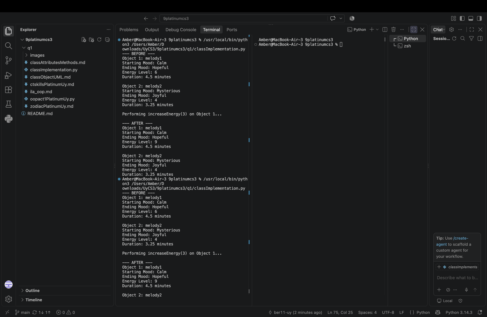
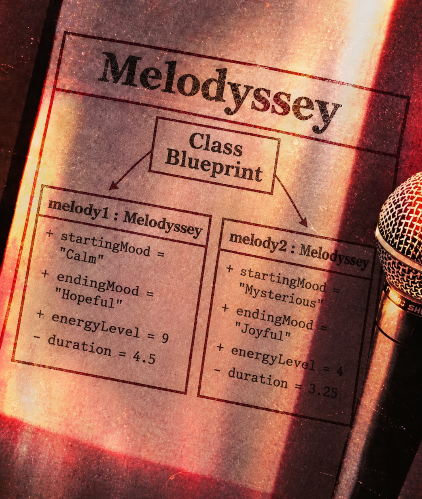

# Class Attributes and Methods

## Previous Design

Link to my previous activity:

[classObjectUML.md](classObjectUML.md)

## Design Revision

Changes from my previous design:

- The `duration` attribute was changed from public to private because the length of a musical piece should be protected from invalid direct changes.
- The `changeMood()` method now updates the `endingMood` attribute to represent the development of the musical journey.
- The `increaseEnergy()` method now keeps the `energyLevel` within the valid range of 1 to 10.
- A `getDuration()` method was added to safely access the private `duration` attribute.
- The overall class and music-journey concept remain the same as my original SG4 design.

## Visibility Decisions

| Attribute | Data Type | Visibility | Reason |
|---|---|---|---|
| `startingMood` | `string` | Public | It describes the starting point of the musical journey and can be accessed for displaying or comparing the journey. |
| `endingMood` | `string` | Public | It represents the current ending mood of the journey and can be updated through the `changeMood()` method. |
| `energyLevel` | `int` | Public | It represents the energy of the music and can be safely changed through the `increaseEnergy()` method. |
| `duration` | `double` | Private | It should be protected from invalid direct changes, such as setting the duration to a negative value. |

## Updated UML Class Diagram

## Python Implementation

[View Python Source](classImplementation.py)

## Test Run

## Object Diagram

## Analysis

### Why did you make your chosen attribute private?

I made the `duration` attribute private because the length of a musical piece should not be changed directly without checking whether the new value is valid. If another part of the program changed it directly, it could accidentally set the duration to an invalid value such as a negative number. Keeping it private helps protect the object's data and allows the class to control how the duration is accessed.

### Which method changes the state of your object?

The `increaseEnergy(amount : int)` method changes the state of the object by modifying its `energyLevel` attribute. When the method receives an amount, it adds that amount to the current energy level. The method also makes sure that the energy level does not go above the maximum value of 10.

### How did your two objects demonstrate that instances are independent?

The two Melodyssey objects were created from the same class but were given different values. When I increased the energy of Object 1, only Object 1's `energyLevel` changed from 6 to 9. Object 2 remained at its original energy level of 4, showing that each object has its own independent state.

### What is the difference between your class diagram and your object diagram?

The class diagram shows the blueprint of the `Melodyssey` class, including its attributes, data types, visibility, and methods. The object diagram shows actual instances created from that class and their specific values after the program runs. In my project, the class diagram describes what every Melodyssey object can have, while the object diagram shows the actual final states of `melody1` and `melody2`.
