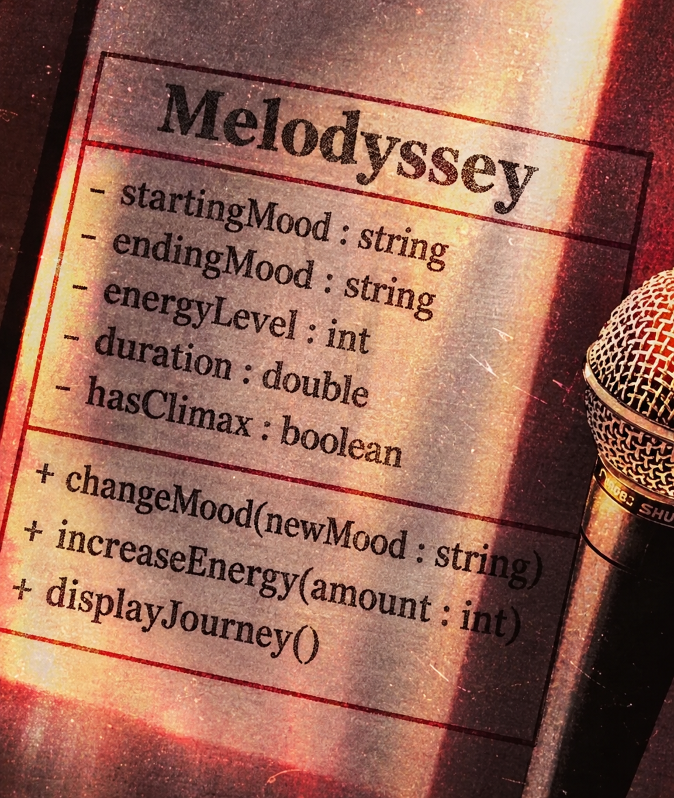

# SG4 - Understanding Classes and Objects

## Class Name

### Melodyssey

## Class Description

Melodyssey represents the journey of a listener through a piece of music, focusing on how the music changes from its beginning to its ending. It describes the musical characteristics that shape the listener's experience, such as mood, energy, tempo, and progression.

## Properties

| Property | Data Type | Description |
|---|---|---|
| `startingMood` | `string` | The emotional mood established at the beginning of the music |
| `endingMood` | `string` | The emotional mood reached at the end of the music |
| `energyLevel` | `int` | Represents how energetic the music feels, from 1 to 10 |
| `duration` | `double` | The length of the musical piece in minutes |

## Methods

| Method | Description |
|---|---|
| `changeMood(newMood : string)` | Changes the current mood of the musical journey to a new mood |
| `increaseEnergy(amount : int)` | Increases the energy level by the specified amount |
| `displayJourney()` | Displays the important information about the musical journey |

## Class Diagram
 

## Design Explanation

### Why did you choose this class?

I chose Melodyssey because I wanted to represent music as more than just a song with a title, artist, or duration. Music can take a listener through different emotions and levels of energy, almost like a journey. This class represents that journey from its beginning to its ending.

### Which property is the most important? Why?

The startingMood property is the most important because it establishes where the musical journey begins emotionally. It provides a point of comparison for the ending mood and helps show how the music changes throughout the experience.

### Which method is the most useful? Why?

The changeMood(newMood : string) method is the most useful because a musical journey can develop and transition between different emotions. This method represents how the feeling of music can change as it progresses.
