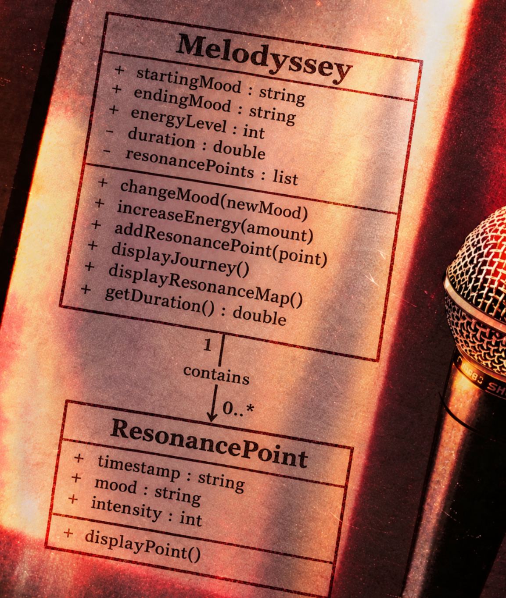
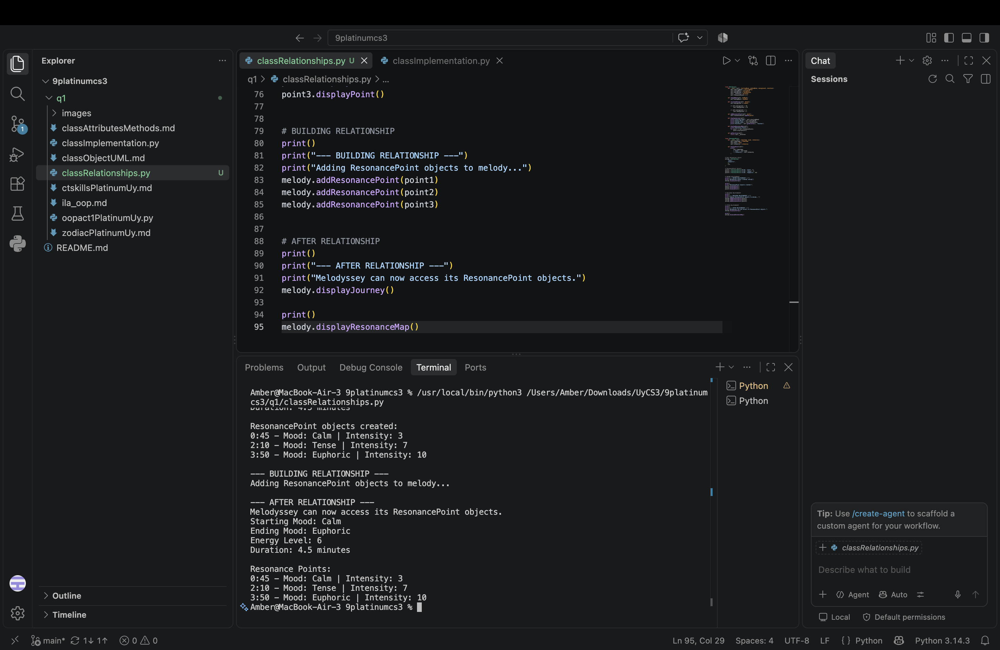
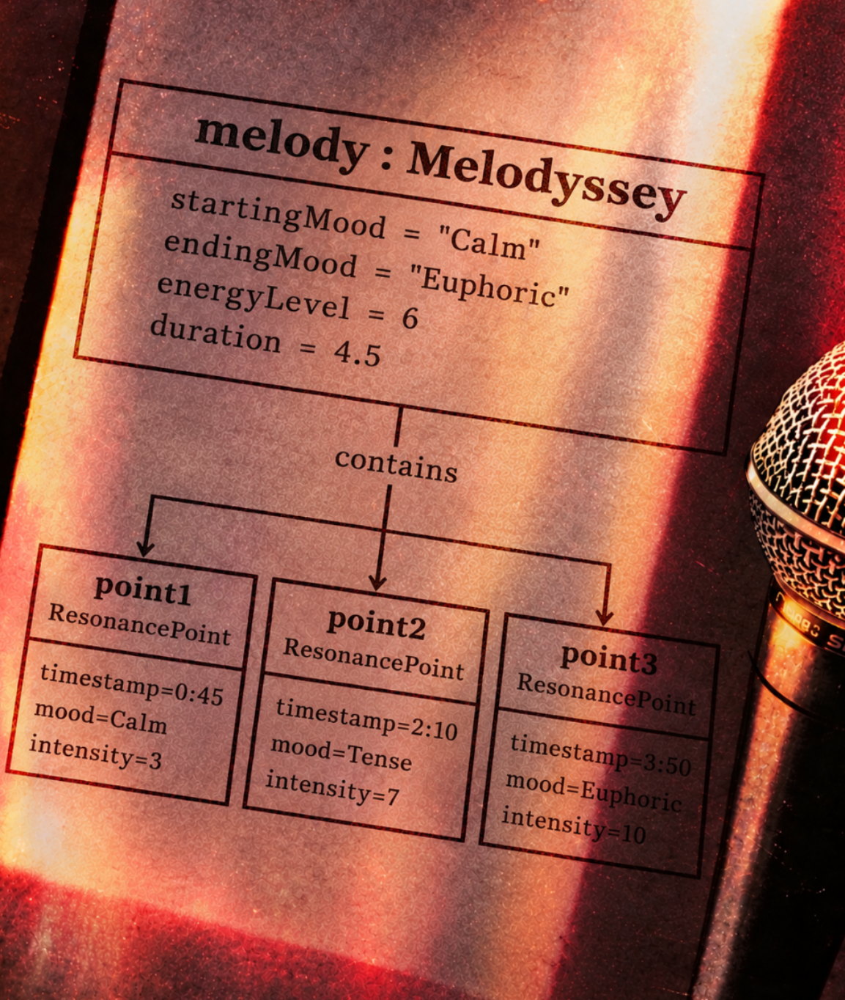

# Class Relationships: Association and Multiplicity

## Previous Work

[Part I - Classes and Objects](classObjectUML.md)

[Part II - Class Attributes and Methods](classAttributesMethods.md)

## Existing Class

**Class:** `Melodyssey`

**Description:**  
Melodyssey represents the journey of a listener through a piece of music, focusing on how the music changes from its beginning to its ending. It describes musical characteristics such as mood, energy, tempo, and progression.

## New Related Class

**Class:** `ResonancePoint`

**Description:**  
ResonancePoint represents a specific moment or checkpoint in a musical journey. Each point records a timestamp, the mood at that moment, and its intensity. This allows a Melodyssey object to keep track of important moments as the music progresses.

### Why should these two classes be connected?

A musical journey can contain several important moments where the mood or intensity changes. Melodyssey represents the overall journey, while ResonancePoint represents individual moments within that journey. Connecting the classes makes the system more detailed because the journey can keep actual ResonancePoint objects instead of only storing separate strings or numbers.

## Association

**Relationship:** `Melodyssey HAS-A / contains ResonancePoint`

**Action phrase:** `contains`

**Explanation:**  
A Melodyssey object contains ResonancePoint objects that mark important moments in the musical journey. The relationship is meaningful because the points belong to the journey being described and provide additional information about how the music develops.

## Multiplicity

**Multiplicity:** `1 : 0..*`

**Explanation:**  
One Melodyssey can contain zero or more ResonancePoint objects because a musical journey can exist even before any specific points are added. Once points are added, the same Melodyssey can contain many of them, such as an opening moment, a build-up, and a climax. This also fits the activity because the related objects can be stored in a Python list.

## UML Class Relationship Diagram 
 

## Python Implementation 
[View Python Source](classRelationships.py) 

## Test Run 
 

## Object Relationship Diagram 
 

## Analysis

### What is the association between your two classes? 

The association between `Melodyssey` and `ResonancePoint` is a HAS-A relationship because a `Melodyssey` contains `ResonancePoint` objects. The `Melodyssey` represents the complete musical journey, while each `ResonancePoint` represents one important moment within that journey. In my implementation, the `melody` object contains `point1`, `point2`, and `point3`.

### What multiplicity did you choose and why? 

I chose a `1 : 0..*` multiplicity. One `Melodyssey` can exist with no `ResonancePoint` objects at first, but it can also contain many points as the musical journey is described in more detail. This fits the concept because a piece of music can have several important moments, such as its opening, build-up, and climax.

### How did you implement the relationship in Python? 

I implemented the relationship using the `resonancePoints` list inside the `Melodyssey` class. The `addResonancePoint()` method receives a `ResonancePoint` object and stores the actual object in the list. I then added `point1`, `point2`, and `point3` using this method, allowing the `Melodyssey` object to access their data.

### Why did you store an object reference instead of copying its data?

I stored object references so that the `Melodyssey` object is connected to the actual `ResonancePoint` objects. For example, `melody.addResonancePoint(point1)` stores `point1` itself instead of only storing its timestamp, mood, or intensity. This allows the `Melodyssey` object to access the attributes and methods of each related `ResonancePoint`.

### If your relationship uses many, why is a list appropriate?

A list is appropriate because one `Melodyssey` can contain many `ResonancePoint` objects. The `resonancePoints` list stores the actual objects `point1`, `point2`, and `point3`. A loop can then go through the list and access the data of each related object.

